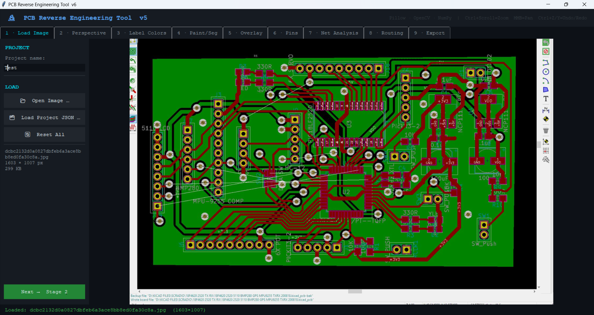
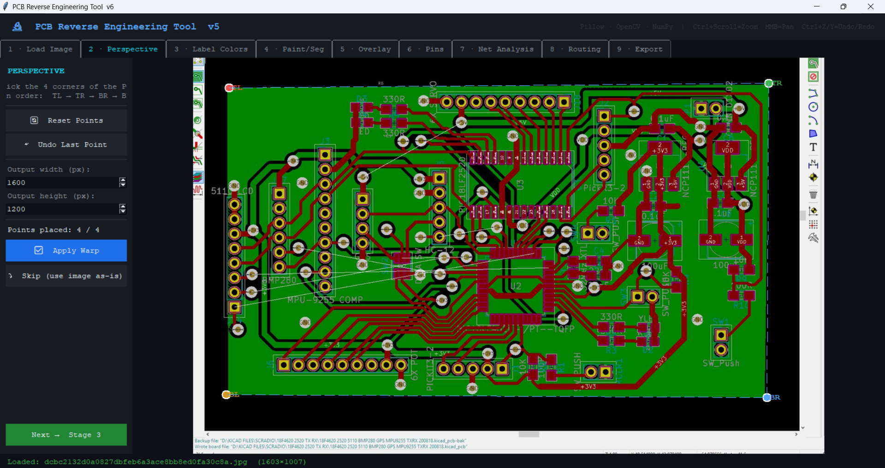
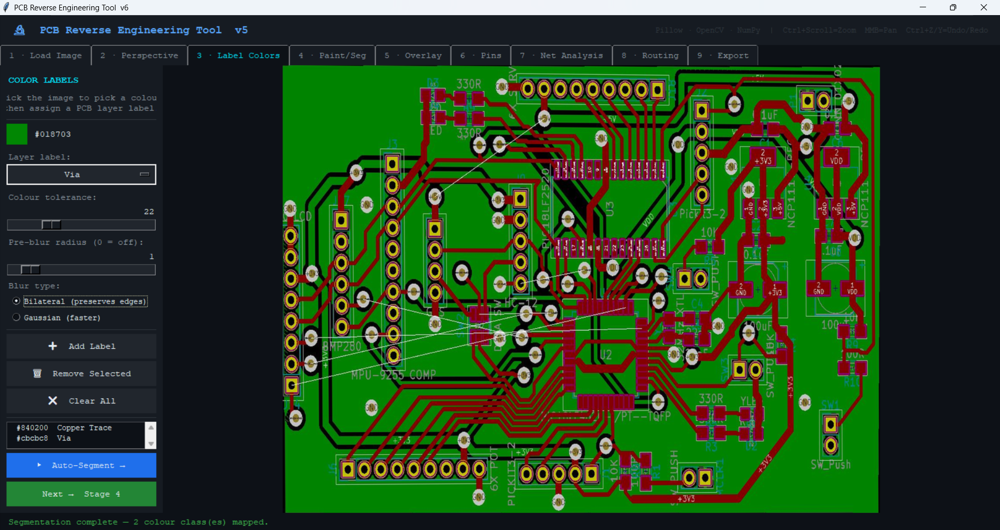
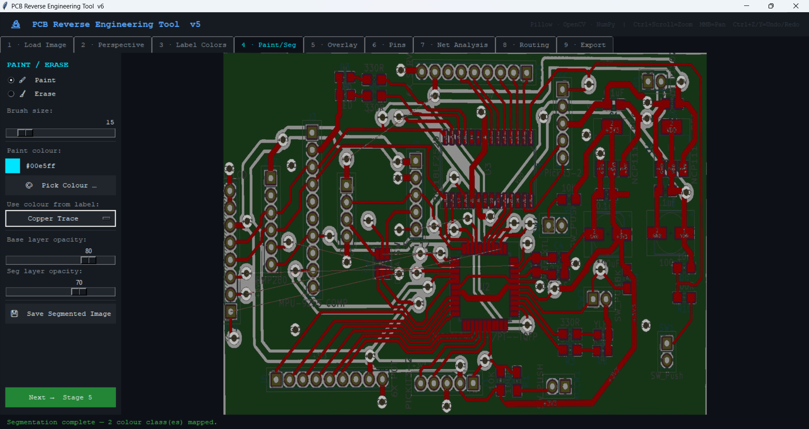
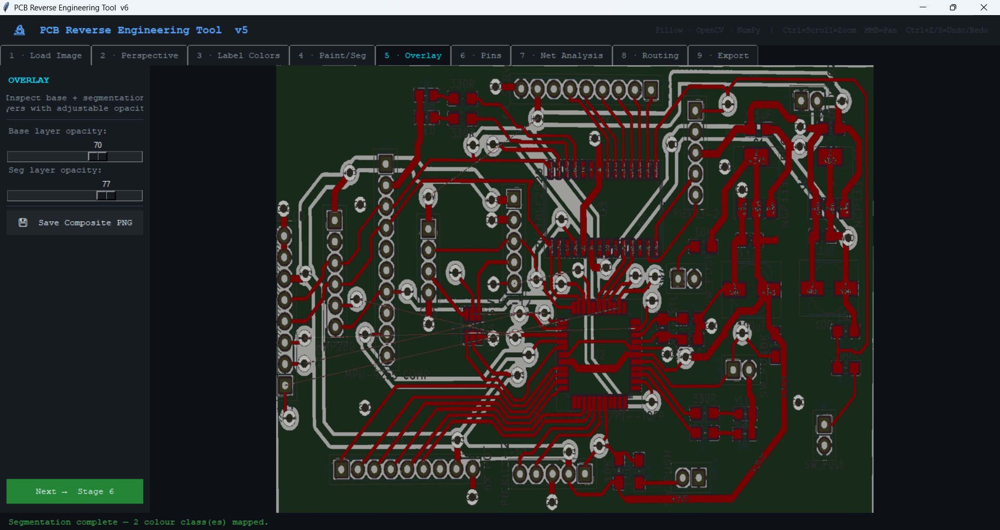
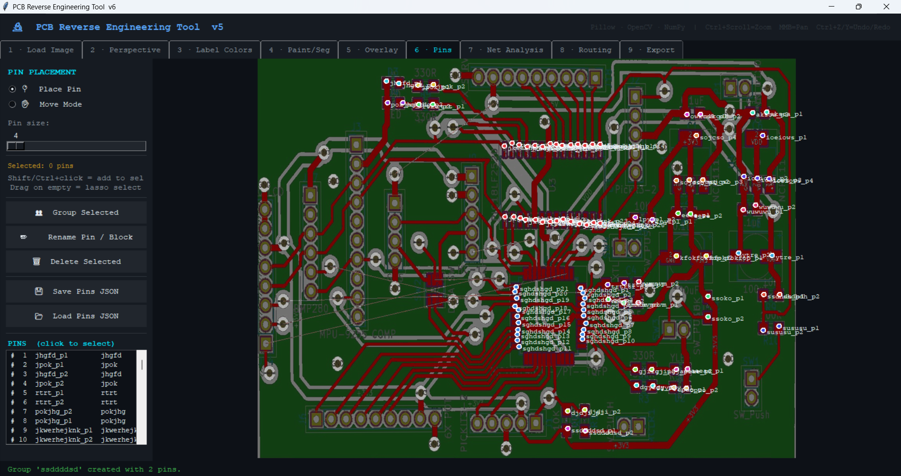
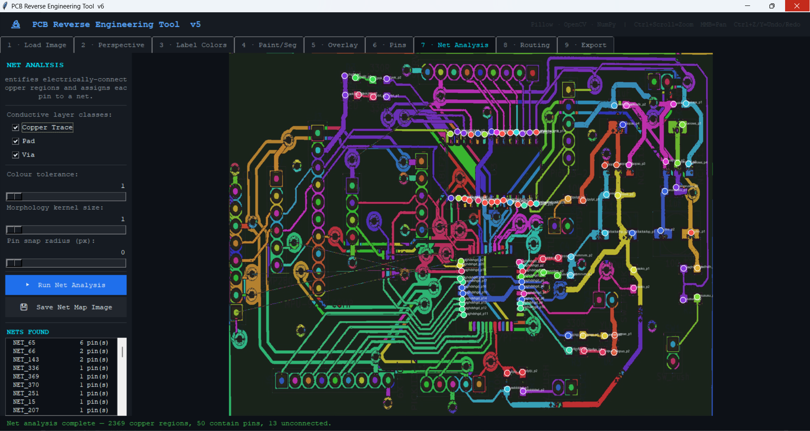
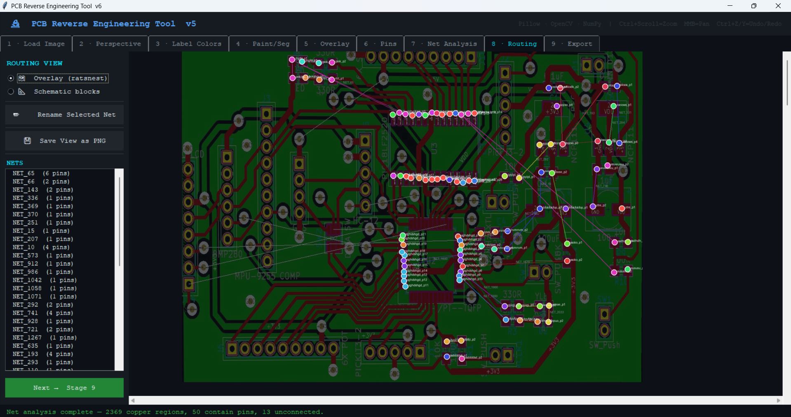
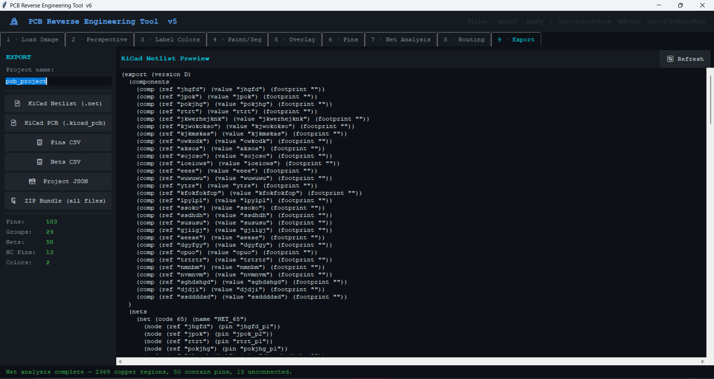

# PCB Reverse Engineering Tool V6

## Overview

PCB Reverse Engineering Tool V6 is a high-performance desktop application for analyzing, segmenting, annotating, tracing, and exporting PCB (Printed Circuit Board) data from images.

The tool is built using:

* Python
* Tkinter
* OpenCV
* NumPy
* Pillow (PIL)

It is designed specifically for:

* PCB reverse engineering
* Net tracing
* Hardware analysis
* PCB documentation
* Circuit reconstruction workflows
* Semi-automated schematic extraction
* Image-based PCB inspection

The architecture is optimized for handling large PCB images efficiently using:

* Tile-based viewport rendering
* NumPy accelerated image processing
* Memory-bounded caching
* LAB color segmentation
* Dirty-rectangle redraw optimization
* Undo/redo delta storage
* Multi-stage modular workflow

---

# Key Features

## Core Features

### 1. PCB Image Loading

* Supports:

  * PNG
  * JPG
  * JPEG
  * BMP
  * TIFF
  * WEBP
* Large image handling
* Automatic RGBA conversion
* Safe image size validation

---

### 2. Perspective Correction

* 4-point perspective correction
* OpenCV homography transformation
* PCB flattening from angled photographs
* Adjustable output resolution
* Perspective warp using:

```python
cv2.getPerspectiveTransform()
cv2.warpPerspective()
```

---

### 3. LAB Color Space Segmentation

The tool uses:

* LAB color space
* Perceptual Delta-E style comparison
* NumPy vectorized operations

instead of traditional RGB Euclidean segmentation.

Benefits:

* Better trace isolation
* More accurate copper extraction
* Better tolerance against lighting variations
* Improved segmentation quality

---

### 4. Interactive Paint and Erase Engine

Features:

* Paint mode
* Erase mode
* Adjustable brush size
* Color assignment
* Overlay blending
* Real-time editing
* Delta undo system

Uses:

* Dirty rectangle redraw
* NumPy alpha compositing
* Partial canvas updates

for extremely fast interaction.

---

### 5. Overlay Rendering

Overlay system supports:

* Base image opacity
* Segmentation opacity
* Multi-layer visualization
* Composite rendering
* Cached redraw pipeline

---

### 6. Pin Detection and Annotation

Features:

* Manual pin placement
* Group creation
* Pin labeling
* Lasso selection
* Group renaming
* Net grouping
* Snap radius support

Pins are rendered using:

```python
create_oval()
create_text()
```

instead of raster redraw.

---

### 7. Net Analysis

Features:

* Trace connectivity analysis
* Morphological operations
* Gap bridging
* Connected component analysis
* Net extraction

OpenCV operations used:

```python
cv2.dilate()
cv2.morphologyEx()
cv2.connectedComponents()
```

---

### 8. Routing Visualization

Features:

* Schematic-style net visualization
* Routing display
* Scrollable board view
* Group visualization
* Net path rendering

---

### 9. Export System

Exports:

* PNG
* JSON
* CSV
* ZIP bundle
* KiCad PCB file

Includes:

* Net data
* Pin coordinates
* Layer labels
* Segmentation output
* Project metadata

---

# Architecture

## Application Pipeline

```text
Stage 1  -> Load Image
Stage 2  -> Perspective Correction
Stage 3  -> Color Labeling
Stage 4  -> Paint / Segmentation
Stage 5  -> Overlay Visualization
Stage 6  -> Pin Mapping
Stage 7  -> Net Analysis
Stage 8  -> Routing Visualization
Stage 9  -> Export
```

---

# Technical Architecture

## State Management

The application uses split-state architecture:

```python
ProjectData
RenderState
UIState
ProcessingCache
```

Benefits:

* Better maintainability
* Cleaner separation of concerns
* Reduced accidental state corruption
* Faster rendering invalidation
* Easier debugging

---

# Major Optimizations Implemented

## 1. Main Thread Safe State Mutation

Worker threads compute data.

UI state changes occur only using:

```python
after(0, callback)
```

Benefits:

* Prevents Tkinter thread crashes
* Improves stability
* Prevents race conditions

---

## 2. NumPy-Centric Rendering Pipeline

Internal image representation:

```python
np.ndarray
```

instead of repeated PIL conversions.

Benefits:

* Faster processing
* Lower memory fragmentation
* Better vectorization

---

## 3. NumPy Alpha Compositing

Custom compositor:

```python
_np_alpha_composite()
```

Benefits:

* Avoids repeated PIL alpha_composite calls
* Lower CPU usage
* Faster overlay redraws

---

## 4. LAB Space Segmentation

Uses:

```python
cv2.cvtColor(..., cv2.COLOR_RGB2LAB)
```

Benefits:

* Perceptual segmentation
* More reliable PCB trace extraction
* Better tolerance to image artifacts

---

## 5. Vector Pin Rendering

Pins rendered as Tk canvas vectors.

Benefits:

* Near-zero redraw cost
* Smooth interaction
* Better zoom scaling

---

## 6. Tile-Based Viewport Rendering

Only visible image regions are rendered.

Benefits:

* Massive memory reduction
* Large image support
* Faster zoom and pan

---

## 7. LRU Memory Cache

Features:

* 256 MB hard memory cap
* Automatic eviction
* Cached zoom levels

Benefits:

* Prevents RAM explosion
* Stable long-session performance

---

## 8. int16 Intermediate Buffers

Used for:

* LAB difference calculations
* Segmentation computations

Benefits:

* Lower memory usage
* Faster cache utilization

---

## 9. Dirty Rectangle Redraw

Only changed regions are recomposited.

Benefits:

* Extremely responsive painting
* Reduced GPU/CPU load

---

## 10. Delta Undo System

Stores:

```python
Changed image regions only
```

instead of full image snapshots.

Benefits:

* Huge memory reduction
* Faster undo/redo
* Scalable editing workflow

---

# Installation

## Requirements

## Python Version

Recommended:

```text
Python 3.10+
```

---

## Dependencies

Install dependencies:

```bash
pip install Pillow opencv-python numpy
```

---

# Project Structure

```text
project/
│
├── pcb_reverse_engineeringV6.py
├── README.md
├── exports/
├── images/
├── samples/
└── requirements.txt
```

---

# Running the Application

```bash
python pcb_reverse_engineeringV6.py
```

---

# User Workflow

## Stage 1 — Load PCB Image

### Purpose

Load raw PCB image.

### Recommended Input

* High resolution
* Uniform lighting
* Minimal blur
* Top-down capture

### Result

Raw image imported into rendering pipeline.

---

## Stage 2 — Perspective Correction

### Purpose

Flatten PCB image.

### Workflow

1. Select:

   * Top Left
   * Top Right
   * Bottom Right
   * Bottom Left

2. Apply perspective warp.

### Result

Rectified PCB image.

---

## Stage 3 — Color Labeling

### Purpose

Assign PCB layers.

### Supported Layers

* Copper Trace
* Pad
* Via
* Silk Screen
* Solder Mask
* PCB Substrate
* Background

### Result

Layer segmentation configuration.

---

## Stage 4 — Paint / Segmentation

### Purpose

Manual cleanup and correction.

### Tools

* Paint
* Erase
* Brush sizing
* Opacity controls
* Undo/Redo

### Result

Clean segmentation map.

---

## Stage 5 — Overlay Visualization

### Purpose

Verify segmentation quality.

### Result

Layer comparison and validation.

---

## Stage 6 — Pin Annotation

### Purpose

Mark PCB pins and groups.

### Features

* Pin creation
* Grouping
* Selection tools
* Renaming
* Deletion

### Result

Logical pin structure.

---

## Stage 7 — Net Analysis

### Purpose

Extract connectivity.

### Operations

* Morphological cleanup
* Trace merging
* Connected component analysis

### Result

Detected electrical nets.

---

## Stage 8 — Routing Visualization

### Purpose

Visualize routing relationships.

### Result

Simplified routing representation.

---

## Stage 9 — Export

### Purpose

Export processed project.

### Export Formats

* PNG
* JSON
* CSV
* ZIP
* KiCad PCB

### Result

Portable reverse engineering dataset.

---

# Use Cases

## 1. PCB Reverse Engineering

Reconstruct old or undocumented boards.

---

## 2. Repair and Diagnostics

Trace damaged PCB connections.

---

## 3. Educational Analysis

Understand routing and board architecture.

---

## 4. Legacy Hardware Reconstruction

Recreate discontinued electronics.

---

## 5. Hardware Documentation

Generate PCB documentation for archival.

---

## 6. Open Hardware Projects

Digitize community PCB designs.

---

## 7. Failure Analysis

Locate disconnected or damaged traces.

---

# Libraries Used

## OpenCV

Used for:

* Perspective transforms
* Morphology
* Image filtering
* Connected components
* LAB conversion

---

## NumPy

Used for:

* Rendering pipeline
* Alpha compositing
* Memory optimization
* Vectorized segmentation

---

## Pillow (PIL)

Used for:

* File IO
* Image display
* Canvas conversion

---

## Tkinter

Used for:

* GUI
* Canvas rendering
* User interaction
* Multi-stage workflow

---

# Performance Improvements vs Previous Versions

| Feature      | Previous Versions     | V6                  |
| ------------ | --------------------- | ------------------- |
| Rendering    | Full redraw           | Dirty rect redraw   |
| Segmentation | RGB Euclidean         | LAB perceptual      |
| Cache        | Unbounded             | 256MB LRU           |
| Undo         | Full image copy       | Delta patches       |
| Rendering    | PIL heavy             | NumPy optimized     |
| Zoom         | Full resize           | Tile rendering      |
| Threading    | Unsafe state writes   | Main-thread safe    |
| Memory       | float32 intermediates | int16 intermediates |

---

# Known Limitations

## 1. Semi-Automatic Workflow

Pin placement and labeling still require manual work.

---

## 2. No True OCR Integration

Silkscreen text extraction is not implemented.

---

## 3. No Automatic Schematic Reconstruction

Connectivity extraction exists, but full schematic generation is not implemented.

---

## 4. Single Image Dependency

Accuracy depends heavily on image quality.

---

## 5. Multi-Layer PCB Complexity

Inner layers cannot be reconstructed from a single image.

---

# Future Improvements

## AI/ML Improvements

### Planned Features

* Automatic trace detection
* AI pin classification
* OCR for silkscreen labels
* Automatic component detection
* AI-assisted net extraction

Recommended models:

* YOLO
* SAM (Segment Anything)
* OCR models
* Vision Transformers

---

## Additional Engineering Features

### Suggested Additions

* Gerber export
* IPC-2581 export
* BOM extraction
* Component library integration
* Multi-image layer fusion
* Differential pair detection
* Via chain reconstruction
* Auto trace vectorization
* Real-time graph connectivity engine

---

## UI Improvements

### Suggested Improvements

* Dockable panels
* GPU acceleration
* Multi-monitor support
* Minimap navigation
* Dark/light themes
* Layer tree system
* Hotkey remapping

---

# Recommended Hardware

## Minimum

* 8 GB RAM
* Dual-core CPU
* Integrated GPU

---

## Recommended

* 16+ GB RAM
* SSD storage
* Dedicated GPU
* High-resolution monitor

---

# Best Practices

## PCB Imaging Recommendations

For best results:

* Use diffuse lighting
* Avoid reflections
* Use tripod mounting
* Capture perpendicular images
* Use high-resolution camera
* Maintain consistent exposure

---

# Example Workflow

```text
1. Capture PCB image
2. Load image
3. Correct perspective
4. Label copper traces
5. Auto segment
6. Manually clean segmentation
7. Add pins
8. Analyze nets
9. Export KiCad project
```

---

# Example Screenshots Section

## Recommended GitHub Folder Structure

```text
images/
├── stage1_load.png
├── stage2_perspective.png
├── stage3_segmentation.png
├── stage4_paint.png
├── stage5_overlay.png
├── stage6_pins.png
├── stage7_nets.png
├── stage8_routing.png
└── stage9_export.png
```

---

# README Image Embedding

## Stage 1

```markdown

```

## Stage 2

```markdown

```

## Stage 3

```markdown

```

## Stage 4

```markdown

```

## Stage 5

```markdown

```

## Stage 6

```markdown

```

## Stage 7

```markdown

```

## Stage 8

```markdown

```

## Stage 9

```markdown

```

---

# requirements.txt

```text
numpy
opencv-python
Pillow
```
---

# Conclusion

PCB Reverse Engineering Tool V6 is a highly optimized image-based PCB analysis platform focused on:

* Performance
* Large-image handling
* Interactive segmentation
* Net extraction
* Reverse engineering workflows

The architecture already demonstrates strong engineering decisions:

* Memory-aware rendering
* Thread-safe GUI handling
* Efficient NumPy processing
* Scalable viewport rendering
* Modular workflow design

The foundation is strong enough for:

* Advanced AI integration
* Automated reconstruction systems
* Industrial-grade PCB analysis workflows
* Commercial reverse engineering tools

---

# Author

* Kevin Davees

